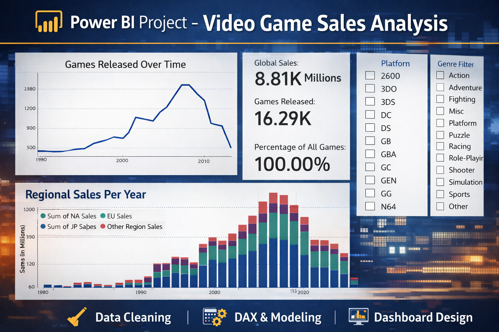

# 🎮 Video Game Sales Dashboard (Power BI)

## 📊 Project Overview
This project presents an interactive Power BI dashboard analyzing global video game sales data.  
It provides insights into sales performance across different regions, genres, platforms, and publishers.

---

## 📁 Dataset
- Source: Video Game Sales Dataset
- Files Included:
  - Cleaned dataset (CSV)
  - Raw dataset (CSV)

---

## ⚙️ Tools & Technologies Used
- Power BI
- Microsoft Excel / CSV
- Data Cleaning & Visualization

---

## 📌 Key Insights
- 🎯 Top-selling video game genres globally  
- 🌍 Region-wise sales comparison (NA, EU, JP, Others)  
- 🎮 Best-performing gaming platforms  
- 🏢 Leading publishers based on global sales  

---

## 📷 Dashboard Preview

---

## 🚀 How to Use
1. Download the `.pbix` file  
2. Open it in Power BI Desktop  
3. Explore interactive visuals and insights  

---

## ⭐ Support & Feedback

If you found this project insightful, please consider giving it a ⭐ on GitHub.  
Your support is greatly appreciated and helps me continue building impactful data analytics projects.  
I welcome any feedback or suggestions for improvement.

---

## 👤 Author

**Jeetendra**  
Aspiring Data Analyst skilled in Power BI and data visualization, focused on turning data into meaningful insights and building real-world analytics projects.
